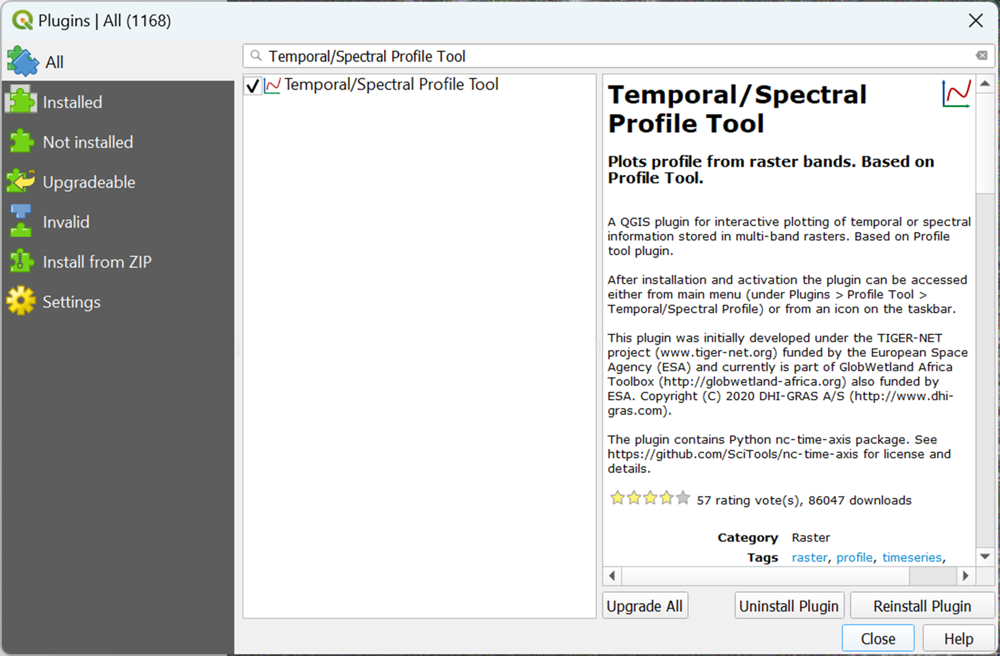
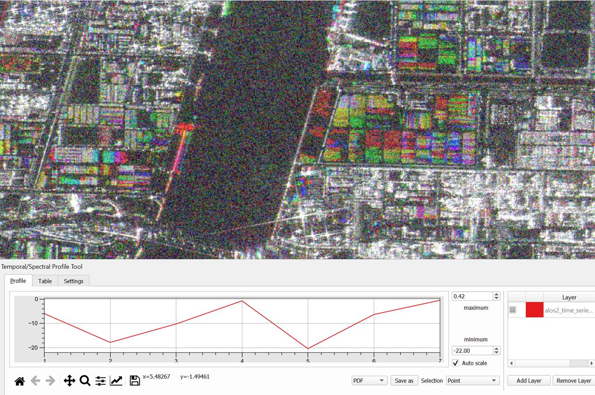
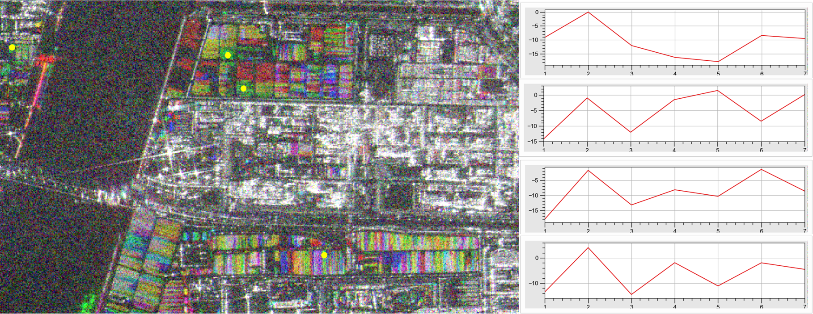

# 10.3 Composing time-series data and interpretation of ALOS data to identify changes
This section introduces participants to ......

## Content:
- 10.3.1 Creating the time-series data 
- 10.3.2 Interpreting time-series data to identify temporal changes 

## 10.3.1 Creating the time-series data 

### a. [The Complete Guide to Time Series Forecasting Models](https://medium.com/@wainaina.pierre/the-complete-guide-to-time-series-forecasting-models-ef9c8cd40037)

This website provides a comprehensive overview of Time Series Forecasting. It explains how to analyze data that changes over time, using statistical models to make predictions about future trends.

Learners wil understand the points below from this content:
1. **Time Series Data Characteristics:** Data points are ordered chronologically, and each observation is dependent on the previous one. Understanding trends, seasonality, and noise helps in analyzing the data.
2. **Importance of Stationarity:** Stationary data, where properties like mean and variance stay constant, is easier to analyze. Stationarity ensures that statistical models, such as ARIMA, perform accurately.
3. **Time Series Models:** Several models like AR, MA, ARIMA, SARIMA, and machine learning models (RNNs, LSTMs) are used to capture patterns and predict future values. Each model is suitable for different types of time series data (e.g., with or without seasonality or trends).
4. **Model Evaluation:** Metrics such as MAE, RMSE, and MAPE help in assessing the accuracy of these models. Cross-validation techniques ensure models generalize well to new data.
5. **Python vs. R:** Both languages are effective for time series forecasting. Python is more versatile, especially for machine learning, while R excels in statistical modeling and visualization.

### b. [Time-Series Analysis of Satellite Data: Unveiling Trends and Patterns](https://flypix.ai/blog/time-series-analysis-of-satellite-data-unveiling-trends-and-patterns/)

The article on time-series analysis of satellite data:
1. **Understanding Changes Over Time:** Time-series analysis of satellite imagery helps monitor and interpret changes in the Earth's surface, such as vegetation, water bodies, and infrastructure, by analyzing images captured at regular intervals over a period of time.
2. **Applications in Environmental and Urban Monitoring:** This technique is valuable for various applications like monitoring vegetation health (using indices like NDVI), detecting deforestation, assessing sea level rise, coastal erosion, and analyzing urbanization trends and land use changes.
3. **Disaster Response and Recovery:** Time-series analysis is crucial for assessing the impact of natural disasters. It helps emergency responders and policymakers allocate resources, plan recovery efforts, and make informed decisions on infrastructure rebuilding and long-term recovery.
4. **Challenges in Data Analysis:** The process faces challenges like ensuring the quality of satellite imagery, managing large datasets with high computational demands, and requiring domain expertise for accurate interpretation of trends.
5. **Future Potential and Technological Advancements:** As technology advances, time-series analysis will continue to improve, offering deeper insights into environmental and societal changes. Platforms like FlyPix AI aim to simplify and enhance this analysis, enabling organizations to make data-driven decisions.

### c. [Creating time-series data from ALOS-2 imagery]()

For this tutorial, we provide hands-on guidance on how to prepare time-series data from ALOS-2 imagery. This hands-on provided step-by-step instructions to prepare time-series data from ALOS-2 imagery in Python.

The code processes ALOS-2 satellite images by loading an Area of Interest (AOI) shapefile and a list of image paths, followed by a series of steps for each image: clipping it to the AOI, applying calibration using a logarithmic transformation, and filtering with a Lee filter. Each processed image—original clipped, calibrated, and filtered—is visualized side by side for comparison. The filtered images are resized to a common shape to ensure consistency, and they are then stacked into a multi-band GeoTIFF file. Finally, the stacked image is saved to a specified output path, allowing for further analysis of the time-series data.

- [Hands-on guidance for prepare_time-series_data_from_ALOS-2_imagery](code/10.3.Prepare_time-series_data_from_ALOS-2_imagery.ipynb)

**The guidance on how to prepare time-series data from ALOS-2 imagery**

Preparing time-series data from ALOS-2 imagery involves processing multiple images taken at different times and aligning them to analyze changes over time. These steps will allow you to create a consistent and analyzable time-series dataset from ALOS-2 imagery, enabling the identification of temporal trends and changes within your AOI. Here are the detailed steps to prepare and analyze time-series data from ALOS-2 imagery:

**Step 1: Collect and Organize ALOS-2 Images**
Gather all ALOS-2 images of the area of interest (AOI) taken over the desired time period. Ensure all images have consistent polarization channels (e.g., HH, HV) and are aligned with the same projection. Organize them in a folder structure where each file represents a different timestamp.

Additional option:
Clipping to Area of Interest (AOI): You may want to clip the image to a specific geographic area using a shapefile or geoJSON.

**Step 2: Load ALOS-2 Data**
Load the ALOS-2 SAR image data into your processing environment. The data often comes in GeoTIFF format with multiple polarization bands (like HH, HV, VH, and VV). In this case, we will use the alos-2 on HH polarization.

**Step 3: Calibrate Images**

Apply Radiometric calibration factors to convert digital numbers to backscatter values. Apply the calibration formula 20*log10(band) - 83 to each band of each image. This step ensures consistency in data interpretation across time.

Radiometric calibration is crucial for converting ALOS-2 SAR data into physically meaningful values (like backscatter) that accurately represent the reflectivity of the Earth's surface. It ensures that the data is corrected for sensor biases, comparable across different sensors or acquisition times, and suitable for detailed analysis like environmental monitoring, land use classification, and disaster management.

Reference: [Calibration Result of ALOS-2/PALSAR-2 JAXA Standard Products](https://www.eorc.jaxa.jp/ALOS-2/en/calval/calval_index.htm)

**Step 4: Apply Speckle Filtering**

Reduce speckle noise across the time-series images to make the time-series analysis more robust. Apply a Lee filter to each calibrated band. Filtering helps to smooth out noise and is especially useful for visualizing temporal changes.

**Step 5: Stack Images into a Time-Series**

Composing a time-series stack involves combining multiple ALOS-2 images from different dates into a single multi-layer image. This way, each layer represents data from a specific date, allowing you to analyze temporal changes.

Combine all normalized images into a single 3D array (time-series cube) for time-based analysis. Each layer represents a different year, creating a consistent data cube for analysis. The array will be structured as (time, width, height).

**Step 6: Analyze and Visualize Temporal Changes**

Perform temporal analysis, such as change detection, trend analysis, or time-series visualization. You can calculate differences, detect significant changes, or plot the values over time for specific areas within the AOI. Visualization can be done using libraries like matplotlib.

## 10.3.2 Interpreting time-series data to identify temporal changes

### Analyzing time-series data to identify changes in container operations and port activity

Stacking ALOS-2 images involves combining multiple SAR images taken over the same area but at different times into a single multi-layered file. By stacking these images, it can compare and analyze changes in surface properties or other factors affecting radar backscatter over time within the area of interest (AOI).

To analyze time-series data for the results of identifying changes in container operations and port activity from ALOS-2 SAR data in QGIS, you can follow these steps. The goal is to visualize specific change locations between different periods and interpret the change location.

#### Load Time-Series Raster Data

- Load the raster layers representing the time series for the area you want to analyze (e.g., stacked image).
- Make sure each layer represents a different time step (e.g., yearly or monthly data).

NOTE: ....

#### The Temporal/Spectral Profile Tool Tool Plugin

The Temporal/Spectral Profile Tool in QGIS is useful for analyzing changes over time in multispectral satellite imagery. It allows you to visualize and interpret how the spectral values (or any raster values) at a specific location change over time. This is particularly helpful when dealing with time series data, such as Landsat or Sentinel imagery, and you want to monitor changes like land cover, vegetation health, or environmental phenomena. The general approach is to:

- Install the Temporal/Spectral Profile Plugin
- Open QGIS and navigate to the Plugins menu.
- Select Manage and Install Plugins.
- Search for “Temporal/Spectral Profile” and install the plugin.

#### Activate the Temporal/Spectral Profile Tool

- Once installed, go to the Plugins menu and select Temporal/Spectral Profile.
- This will open the Temporal/Spectral Profile window where you can view the graphs.

#### Select the Time Series Layers

- In the Temporal/Spectral Profile window, click the "Add" button to load the time series of rasters.
- Choose the layers that correspond to the temporal data (e.g., Value for different dates or years).
- These layers must have temporal information in their metadata or file names, which the tool uses to organize them chronologically.

#### Pick a Location for Analysis

- In the QGIS canvas, use the tool to select a point of interest (POI) where you want to analyze the changes over time.
- You can click directly on the map or manually input the coordinates.

#### View the Temporal Profile

- The Temporal/Spectral Profile tool will generate a graph that shows the change in raster values over time for the selected location.
- The X-axis represents time (e.g., date or year), and the Y-axis shows the raster values (e.g., back scatter value).

### Interpret changes and visualize trends using graphs

To analyze each location, the plugin generates a graph that reflects the changes in backscatter values over time. For each selected location, the graph presents a timeline of changes, allowing you to observe the intensity and frequency of variations in the backscatter profile. This makes it easier to detect when and where significant changes have occurred, such as shifts in port activity, container operations, or surface conditions.

Here’s the interpretation of the output of the stacked image in different colors and identifying trends of graph patterns representing the following:

- **Black and White color:** These indicates no change occurred throughout the time series for that pixel. 
- **Multiple colors:** These colors indicate the areas where the change occurred. Since the alos2_time_series_stack_ngo.tif contains multiple time layers, the values represent the time layer index when a significant change occurs.
- **Increasing Trends:** Points where the mean value is increasing, suggesting growth or a rise in activity (e.g., more container volume, higher industrial output).
- **Decreasing Trends:** Points where the mean value is decreasing, indicating a decline in activity or a reduction in the monitored feature (e.g., less port activity, fewer cars).
- **Stable Periods:** Sections of the graph where the mean values remain constant, indicating no significant changes in the monitored areas.

The stacked layer contains time-series data from multiple ALOS-2 images that represent changes over time in certain monitored areas, such as container volume, port activity, industrial output, or car density. When comparing multiple locations and analyzing the backscatter profile of a stacked layer, the visualization typically uses color coding to represent changes over time. In this case, black and white tones indicate areas where no significant change has occurred across the time span covered by the stacked imagery. These areas remain stable, suggesting consistent levels of activity or unchanged surface conditions.

In contrast, areas represented by multiple colors highlight locations where changes have occurred. These changes are detected in the backscatter values, which may signify variations in surface properties, such as increased container volume, shifts in port operations, or alterations in industrial activity. Each color represents different degrees or types of changes, enabling clear differentiation between regions undergoing significant transformation.

#### Comparing Multiple Locations and Backscatter Profile for example locations
**Red locations**

**Green locations**

**Yellow locations**

#### Interpretation of Changes
In the example locations of red color, the backscatter values show an overall pattern of initial decreases, indicating a reduction in activity or density over time. Many locations experience periods of decline followed by slight recoveries, though the general trend remains predominantly downward. These trends suggest possible interruptions in port activity, with temporary rebounds that might reflect short-term operational changes. Factors such as the impact of COVID-19 restrictions and other port-related activities could have influenced these patterns, leading to reduced density and, in some cases, a delayed return to previous levels.

In the example locations of green color, the locations show a mix of fluctuations and stabilizing trends. Across all locations, the backscatter values exhibit initial declines followed by brief periods of recovery or stabilization. Locations generally experience early decreases, with some rebounding mid-period, suggesting temporary resumptions in port activity or adjustments in operations. Toward the end, however, values generally trend toward stability or a minor decrease, indicating that while activities may have resumed, they have not fully returned to prior levels. These trends could reflect the intermittent nature of operations, likely influenced by external factors such as varying COVID-19 restrictions and operational changes in the port.

In the example locations of yellow color, locations exhibit varying trends, with early declines followed by moments of partial recovery or stabilization. Most locations experience initial decreases in backscatter values, reflecting possible dips in activity, with some locations showing intermittent recovery, particularly toward the end. However, the general pattern leans towards stability or slight decreases in the latter stages, suggesting that, while there may have been periods of increased operations, overall activity levels remain below previous highs. These trends could reflect ongoing adjustments in port operations or the impact of sporadic restrictions, possibly due to COVID-19 or shifts in port management activities.
